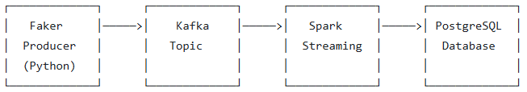
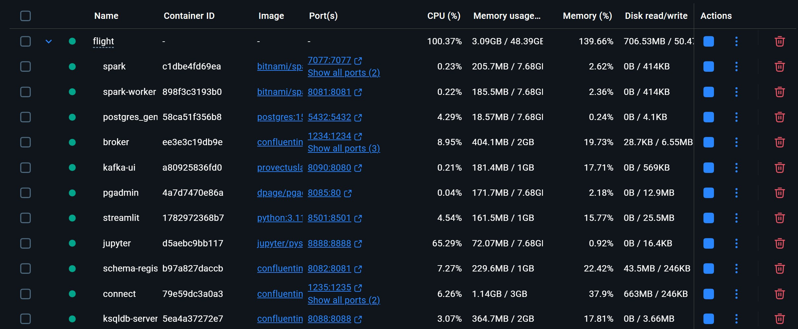
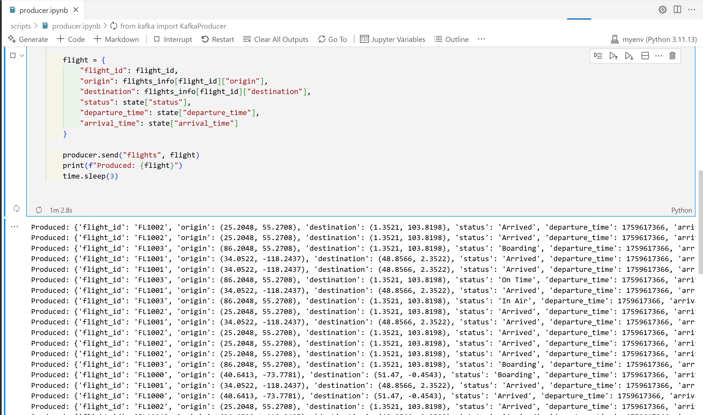
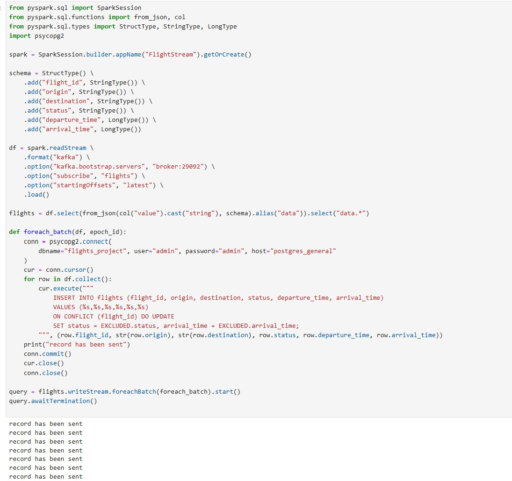
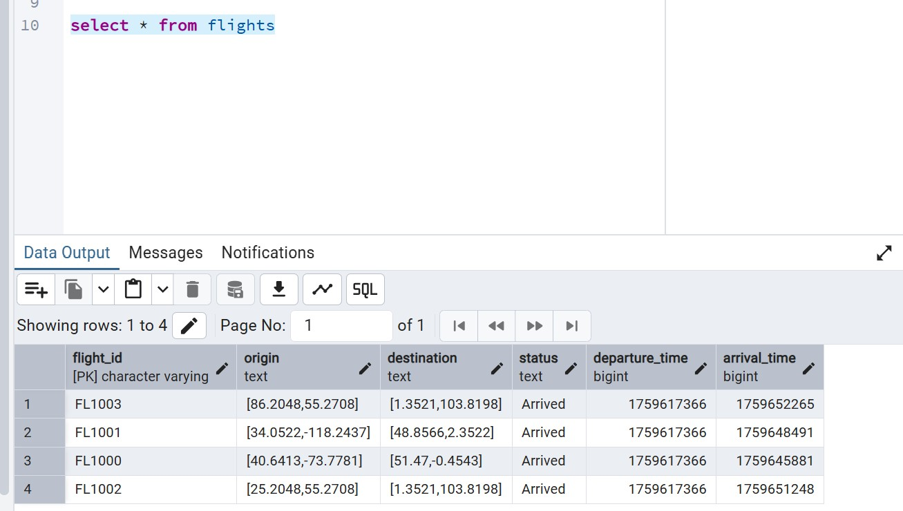
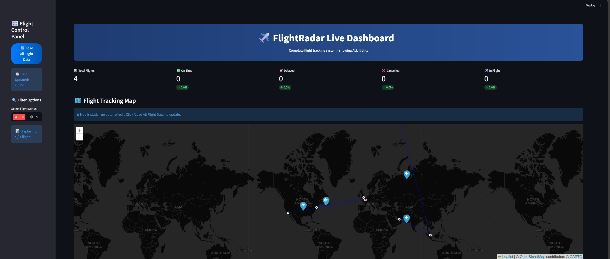
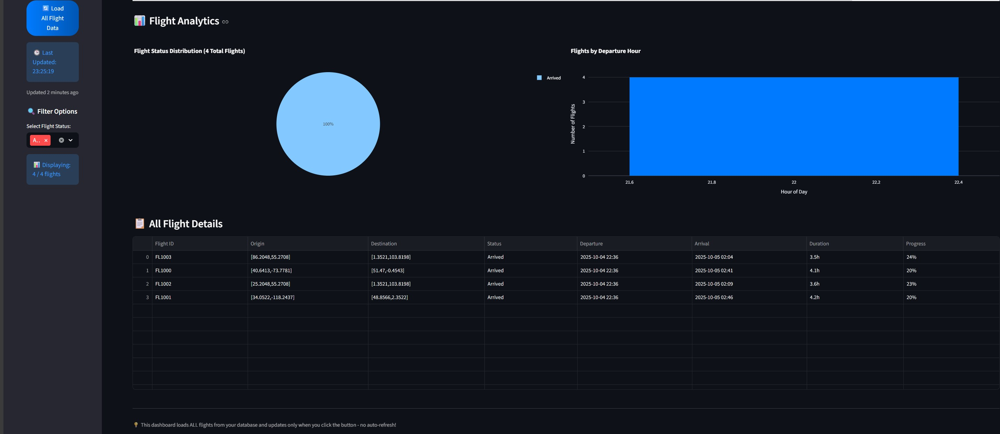

# ✈️ Real-Time Flight Tracking Pipeline
This project implements a real-time flight tracking data pipeline that simulates, processes, and stores flight information using modern data engineering tools and technologies. The pipeline generates synthetic flight data, streams it through Apache Kafka, processes it with Apache Spark Streaming, and persists the latest flight records in PostgreSQL.
## 🏗️ This is the architecture of the project

##
### Step 1:
I ran docker compose yaml file and made sure all containers are running

##

### Step 2:
I made a kafka producer using faker and connected it to the kafka brocker and made sure that the kafka topic is shown in kafka UI I accessed in localhost

##

### Step 3:
I set the connection in postgres and created the flights table in the database
##

### Step 4:
I ran spark code in juperter in localhost and made the schema and required changes of data coming from kafka topic(it's in json format and we need to make it as a table to send it to postgres)

##

### Step 5:
The data reached postgres successfully

##

### Step 6: 
The script file for streamlit worked automatically as soon as the data reached postgres and it's stream 

